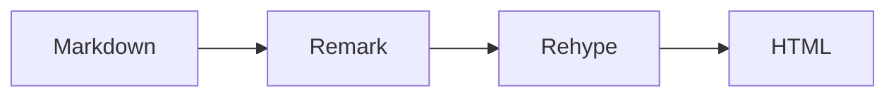
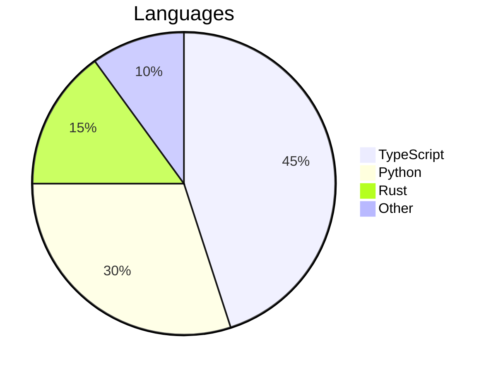

# Markdown

Livemark uses MDX under the hood, combining standard Markdown with JSX capabilities. You can use all standard Markdown features plus the extensions documented below.

## Frontmatter

YAML-based frontmatter is supported at the top of each file:

```yaml
---
title: My Page
description: A brief description of the page.
icon: rocket
---
```

All the fields are optional.

### Article Metadata

TBD

### Sidebar Settings

TBD

## Headings

Headings automatically generate anchor IDs for linking.

### Auto-generated IDs

```md
## My Heading
```

Renders as `<h2 id="my-heading">My Heading</h2>`. IDs are generated using GitHub-compatible slugging.

### Custom Heading IDs [#custom-ids]

Override the auto-generated ID with `[#custom-id]` syntax:

```md
## My Heading [#custom-id]
```

This generates `<h2 id="custom-id">My Heading</h2>`. Link to it with `#custom-id`. This heading itself uses `[#custom-ids]`.

### Heading Levels

Use h2–h4 for content structure. The h1 is reserved for the page title.

Deeper headings (h5, h6) are supported but won't appear in the table of contents.

### TOC Control

Control whether headings appear in the table of contents using annotations.

Hide a heading from the TOC while keeping it visible in the rendered output:

```md
## Visible Heading [!toc]
```

The heading renders normally on the page but is excluded from the table of contents.

Create a TOC-only heading that appears in the table of contents but not in the rendered output:

```md
## Hidden Heading [toc]
```

The heading appears in the TOC for navigation but is removed from the page content.

### Anchor Links on Hover

Headings with IDs show a link icon on hover. Click to copy the anchor URL for sharing.

### Inline Table of Contents

Insert a table of contents anywhere in your content using the `::toc` directive:

```md
::toc
```

Limit the depth with `maxLevel`:

```md
::toc{maxLevel=2}
```

Renders as:

::toc{maxLevel=2}

## Links

### Internal Links

Link to other pages in your documentation:

```md
[Getting Started](/docs%2Fgetting-started/)
```

Renders as: [Getting Started](/docs%2Fgetting-started/)

### External Links

Link to external resources:

```md
[GitHub](https://github.com)
```

Renders as: [GitHub](https://github.com)

### Anchor Links

Link to a specific heading on the current page:

```md
[See Custom Heading IDs](#custom-ids)
```

Renders as: [See Custom Heading IDs](#custom-ids)

### Auto Links

URLs are automatically converted to links:

```md
https://github.com/datisthq/livemark
```

Renders as: https://github.com/datisthq/livemark

## Media

### Image Zooming

All images in articles are zoomable — click any image to expand it to full size. This works with internal, external, and base64 images.

### Internal Images

Reference images from your docs directory:

```md

```

Renders as:


### External Images

Reference images from external URLs:

```md

```

Renders as:


### Base64 Images

Embed small images directly using data URIs:

```md

```

Renders as:


### Themed Images

Show different images for light and dark mode using `#light` and `#dark` hash suffixes:

```md


```

Renders as (toggle theme to see the switch):


The `#light` image is hidden in dark mode, and the `#dark` image is hidden in light mode. Use both together for seamless theme switching.

### Video Blocks

Embed videos using the `::video` directive with a `type` attribute:

```md
::video{type="youtube" id="dQw4w9WgXcQ"}
```

Renders as:

::video{type="youtube" id="dQw4w9WgXcQ"}

### Audio Blocks

Embed audio using the `::audio` directive with a `type` attribute:

```md
::audio{type="soundcloud" url="https://soundcloud.com/flume/never-be-like-you-feat-kai"}
```

Renders as:

::audio{type="soundcloud" url="https://soundcloud.com/flume/never-be-like-you-feat-kai"}

## Text Formatting

### Bold and Italic

```md
**bold text** and _italic text_ and **_bold italic_**
```

Renders as: **bold text** and _italic text_ and **_bold italic_**

### Strikethrough

```md
~~deleted text~~
```

Renders as: ~~deleted text~~

### Inline Code

```md
Use `const x = 1` for inline code.
```

Renders as: Use `const x = 1` for inline code.

### Inline Code Highlighting

Add language-specific syntax highlighting to inline code with a `{:lang}` prefix:

```md
Use `{:ts}const x = 1` for inline TypeScript or `{:py}print("hello")` for Python.
```

Renders as:

Use `{:ts}const x = 1` for inline TypeScript or `{:py}print("hello")` for Python.

### Blockquotes

```md
> This is a blockquote.
```

Renders as:

> This is a blockquote.

### Lists

Unordered and ordered lists:

- First item
- Second item
  - Nested item

1. Step one
2. Step two
3. Step three

### Task Lists

```md
- [x] Completed task
- [ ] Pending task
```

Renders as:

- [x] Completed task
- [ ] Pending task

### Horizontal Rules

```md
---
```

---

### Footnotes

Add footnotes using `[^id]` references and definitions:

```md
Here is a sentence with a footnote[^1] and another[^note].

[^1]: This is a numbered footnote.

[^note]: Footnotes can use descriptive identifiers too.
```

Renders as:

Here is a sentence with a footnote[^1] and another[^note].

[^1]: This is a numbered footnote.

[^note]: Footnotes can use descriptive identifiers too.

### Definition Lists

Define terms with their descriptions:

```md
Remark
: A markdown processor powered by plugins

Rehype
: An HTML processor powered by plugins

Unified
: An interface for processing content with syntax trees
: The foundation for both remark and rehype
```

Renders as:

Remark
: A markdown processor powered by plugins

Rehype
: An HTML processor powered by plugins

Unified
: An interface for processing content with syntax trees
: The foundation for both remark and rehype

### Abbreviations

Add tooltips to abbreviations using the `:abbr` directive:

```md
The :abbr[HTML]{title="HyperText Markup Language"} standard is maintained by :abbr[W3C]{title="World Wide Web Consortium"}.
```

Renders as:

The :abbr[HTML]{title="HyperText Markup Language"} standard is maintained by :abbr[W3C]{title="World Wide Web Consortium"}.

### Emoji

Use GitHub-style emoji shortcodes:

```md
:rocket: Launch :tada: Celebrate :heart: Love :warning: Careful :white_check_mark: Done
```

Renders as:

:rocket: Launch :tada: Celebrate :heart: Love :warning: Careful :white_check_mark: Done

See the [full emoji list](https://github.com/ikatyang/emoji-cheat-sheet) for available shortcodes.

## Rich Elements

### Tables

```md
| Feature    | Status    |
| ---------- | --------- |
| Tables     | Supported |
| Task lists | Supported |
```

Renders as:

| Feature    | Status    |
| ---------- | --------- |
| Tables     | Supported |
| Task lists | Supported |

### Callouts

Callouts highlight important information. Available types: note, tip, info, warning, danger.

GitHub syntax:

```md
> [!TIP]
> GitHub syntax also works.
```

Directive syntax:

```md
:::note
This is a note.
:::
```

Custom title:

```md
:::warning[Breaking Change]
This API has been removed in v2.
:::
```

Renders as:

:::note
This is a note.
:::

:::tip
Helpful advice here.
:::

:::warning
Be careful with this.
:::

:::danger
Critical warning!
:::

:::info
Additional context.
:::

:::warning[Breaking Change]
This API has been removed in v2.
:::

### Expandable

Create expandable content using the `:::details` directive:

```md
:::details[Click to expand]
Hidden content here with **markdown** support.
:::
```

Renders as:

:::details[Click to expand]
Hidden content here with **markdown** support.
:::

You can nest any markdown inside, including code blocks, lists, and callouts:

:::details[Configuration example]

```typescript title="livemark.config.ts"
import { defineConfig } from "livemark"

export default defineConfig({
  articles: { include: "docs/*.md" },
})
```

:::

### Code Tabs

Group consecutive code blocks into tabs using `tab="name"` meta:

````md
```js tab="JavaScript"
console.log("hello")
```

```python tab="Python"
print("hello")
```
````

Renders as:

```js tab="JavaScript"
console.log("hello")
```

```python tab="Python"
print("hello")
```

Add `sync="key"` to keep multiple code tab groups in sync across the page. Selecting a tab in one group updates all others with the same key:

````md
```js tab="JavaScript" sync="lang"
console.log("hello")
```

```python tab="Python" sync="lang"
print("hello")
```
````

### Content Tabs

Group arbitrary content into tabs using the `:::tab` directive. Consecutive tabs are automatically grouped.

Add a `sync` attribute to synchronize tab selection across multiple tab groups on the same page. When a user selects a tab in one group, all other groups with the same `sync` key switch to the matching tab. The selection is persisted in localStorage.

```md
:::tab{title="npm" sync="pm"}
npm install livemark
:::

:::tab{title="pnpm" sync="pm"}
pnpm add livemark
:::
```

Here is an example without sync:

```md
:::tab{title="React"}
React uses JSX for templating and hooks for state management.
:::

:::tab{title="Vue"}
Vue uses single-file components with template, script, and style sections.
:::
```

Renders as:

:::tab{title="React"}
React uses **JSX** for templating and hooks for state management.

```jsx
function App() {
  return <h1>Hello</h1>
}
```

:::

:::tab{title="Vue"}
Vue uses **single-file components** with template, script, and style sections.

```vue
<template>
  <h1>Hello</h1>
</template>
```

:::

### Steps

Add `[step]` to headings to create numbered step-by-step guides:

```md
### Install Dependencies [step]

Run `npm install` to add all required packages.

### Configure Project [step]

Create a config file in the project root.

### Deploy [step]

Push to production.
```

Renders as:

### Install Dependencies [step]

Run `npm install` to add all required packages.

### Configure Project [step]

Create a config file in the project root.

### Deploy [step]

Push to production.

### Cards

Create content cards using the `:::card` directive. Consecutive cards are automatically grouped into a grid.

```md
:::card{title="Getting Started" href="/getting-started" icon="rocket"}
Learn how to set up your first project.
:::
```

```md
:::card{title="Configuration" href="/configuration" icon="layers"}
Configure your Livemark project.
:::
```

Renders as:

:::card{title="Getting Started" href="/docs%2Fgetting-started" icon="rocket"}
Learn how to set up your first project.
:::

:::card{title="Configuration" href="/docs%2Fconfiguration" icon="layers"}
Configure your Livemark project.
:::

:::card{title="GitHub" href="https://github.com/datisthq/livemark" icon="github"}
View the source code on GitHub.
:::

:::card{title="Markdown" icon="file-code"}
This page documents all markdown features.
:::

### Badges

Inline status badges using the `:badge` directive:

```md
:badge[Beta] :badge[Deprecated]{variant="destructive"} :badge[New]{variant="secondary"}
```

Renders as:

:badge[Beta] :badge[Deprecated]{variant="destructive"} :badge[New]{variant="secondary"}

### Buttons

Call-to-action link buttons using the `::button` leaf directive:

```md
::button[Get Started]{href="/getting-started"}
```

With variant and size options:

```md
::button[Get Started]{href="/getting-started" variant="default" size="lg"}
::button[Configuration]{href="/docs/configuration" variant="outline"}
::button[View Source]{href="/github" variant="secondary" size="sm"}
```

You can also use the `label` attribute:

```md
::button{href="/getting-started" label="Get Started"}
```

Renders as:

::button[Get Started]{href="/docs%2Fgetting-started" variant="default" size="lg"}
::button[Configuration]{href="/docs%2Fconfiguration" variant="outline"}
::button[View Source]{href="https://github.com/datisthq/livemark" variant="secondary" size="sm"}

Available variants: `default`, `outline`, `secondary`, `ghost`, `destructive`, `link`. Available sizes: `default`, `sm`, `lg`.

### Icons

Inline icons from the Lucide library using the `:icon` directive:

```md
:icon{name="rocket"} Launch :icon{name="check"} Done :icon{name="heart"} Love
```

Renders as:

:icon{name="rocket"} Launch :icon{name="check"} Done :icon{name="heart"} Love

With Tailwind colors:

```md
:icon{name="check" className="text-green-500"} Pass :icon{name="x" className="text-red-500"} Fail :icon{name="star" className="text-yellow-500"} Star
```

Renders as:

:icon{name="check" className="text-green-500"} Pass :icon{name="x" className="text-red-500"} Fail :icon{name="star" className="text-yellow-500"} Star

### File Tree

Display file and directory structures using the `:::filetree` directive. Directories are indicated with a trailing `/`:

```md
:::filetree

- src/
  - components/
    - Button.tsx
    - Card.tsx
  - helpers/
    - style.ts
  - index.ts
- package.json
- tsconfig.json
  :::
```

Renders as:

:::filetree

- src/
  - components/
    - Button.tsx
    - Card.tsx
  - helpers/
    - style.ts
  - index.ts
- package.json
- tsconfig.json

:::

### Columns

Arrange content side by side using consecutive `:::column` directives. They are automatically grouped into a grid:

```md
:::column
**Left column** with markdown content.
:::

:::column
**Right column** with more content.
:::
```

Renders as:

:::column
**Left column** with markdown content, including lists:

- Item one
- Item two

:::

:::column
**Right column** with more content:

> A blockquote works here too.

:::

## Code Blocks

Fenced code blocks are syntax-highlighted with Shiki using catppuccin themes. Each code block includes a word wrap toggle button that switches between horizontal scrolling and wrapped lines.

### Titles

Add a filename or title to code blocks:

````md
```typescript title="livemark.config.ts"
import { defineConfig } from "livemark"
```
````

Renders as:

```typescript title="livemark.config.ts"
import { defineConfig } from "livemark"

export default defineConfig({
  articles: { include: "docs/*.md" },
})
```

### Line Highlighting

Highlight specific lines with `{line,range}` syntax in the meta string or `// [!code highlight]` comments inside the code block.

Using meta syntax:

````md
```typescript {2,4-6}
const a = 1
const b = 2
```
````

Renders as:

```typescript {2,4-6}
const a = 1
const b = 2
const c = 3
const d = 4
const e = 5
const f = 6
```

Using comment syntax (`// [!code highlight]`):

````md
```typescript
const greeting = "hello"
const target = "world" // [!code highlight]
```
````

Renders as:

```typescript
const greeting = "hello"
const target = "world" // [!code highlight]
```

Comment annotations are removed from the rendered output. Block comment syntax `/* [!code highlight] */` is also supported.

### Word Highlighting

Highlight all occurrences of a word with `{word:TERM}` syntax:

````md
```typescript {word:config}
const config = loadConfig()
export default config
```
````

Renders as:

```typescript {word:config}
const config = loadConfig()
export default config
```

### Line Numbers

Display line numbers alongside code with `lineNumbers`:

````md
```typescript lineNumbers
const a = 1
const b = 2
```
````

Renders as:

```typescript lineNumbers
const a = 1
const b = 2
const c = 3
```

Start numbering from a specific line with `lineNumbers=N`:

````md
```typescript lineNumbers=5
const a = 1
const b = 2
```
````

Renders as:

```typescript lineNumbers=5
const a = 1
const b = 2
const c = 3
```

### Diff Lines

Mark lines as added or removed using `// [!code ++]` and `// [!code --]`:

````md
```typescript
const old = "removed" // [!code --]
const next = "added" // [!code ++]
```
````

Renders as:

```typescript
const old = "removed" // [!code --]
const next = "added" // [!code ++]
```

### Focus Lines

Dim all other lines except the focused ones with `// [!code focus]`:

````md
```typescript
const a = 1
const b = 2 // [!code focus]
const c = 3
```
````

Renders as:

```typescript
const a = 1
const b = 2 // [!code focus]
const c = 3
```

### Error and Warning

Mark lines as errors or warnings with `// [!code error]` and `// [!code warning]`:

````md
```typescript
const valid = "ok"
const invalid = null! // [!code error]
const risky = getValue() // [!code warning]
```
````

Renders as:

```typescript
const valid = "ok"
const invalid = null! // [!code error]
const risky = getValue() // [!code warning]
```

### Collapsible Code

Limit the visible height of long code blocks with `maxLines=N`. An "Expand" button reveals the full code:

````md
```typescript maxLines=3
const a = 1
const b = 2
const c = 3
const d = 4
const e = 5
const f = 6
```
````

Renders as:

```typescript maxLines=3
const a = 1
const b = 2
const c = 3
const d = 4
const e = 5
const f = 6
```

### Language Icons

Code blocks automatically display a language icon in the title bar when a title is present. Supported languages include TypeScript, JavaScript, React, Python, Rust, and shell.

```typescript title="example.ts"
const greeting = "hello"
```

```python title="example.py"
greeting = "hello"
```

```rust title="example.rs"
let greeting = "hello";
```

### TypeScript Support

Add `twoslash` to a TypeScript code block to enable inline type information. Hover over highlighted identifiers to see their types:

````md
```typescript twoslash
const greeting = "hello"
//    ^?
```
````

Renders as:

```typescript twoslash
const greeting = "hello"
//    ^?
```

Use `// @errors: 2304` to showcase expected errors:

```typescript twoslash
// @errors: 2304
const x = unknown_var
```

### NPM Commands

Write npm commands and get automatic tabs for all package managers:

````md
```npm
npm install livemark
```
````

Renders as:

```npm
npm install livemark
```

## Advanced Syntax

### HTML Blocks

Standard HTML tags are supported directly in markdown files. Common examples include `<kbd>` for keyboard shortcuts, `<sup>`/`<sub>` for superscripts and subscripts, and `<details>`/`<summary>` for accordions.

```md
Press <kbd>Ctrl</kbd> + <kbd>C</kbd> to copy. Water is H<sub>2</sub>O.
```

Renders as:

Press <kbd>Ctrl</kbd> + <kbd>C</kbd> to copy. Water is H<sub>2</sub>O.

Since Livemark uses MDX, HTML attributes follow JSX conventions: use `className` instead of `class`, and `style` takes an object instead of a string.

Tailwind CSS 4 utility classes are available in HTML blocks via `className`:

```md
<div className="rounded-lg border border-border bg-card p-4 text-sm text-muted-foreground">
  A styled container using Tailwind utilities.
</div>
```

Renders as:

<div className="rounded-lg border border-border bg-card p-4 text-sm text-muted-foreground">
  A styled container using Tailwind utilities.
</div>

### MDX Rendering

Livemark uses MDX under the hood, so JSX expressions and components can be used directly in markdown files when needed:

```md
export const version = "2.0.0"

The current version is **{version}**.
```

You can also import modules:

```md
import { authors } from "./data.ts"

{authors.map(a => <span key={a.name}>{a.name}</span>)}
```

This is an escape hatch for advanced use cases. Prefer standard markdown and directive syntax when possible.

### LaTeX Expressions

LaTeX math expressions are supported via KaTeX.

Inline math uses single dollar signs: `$E = mc^2$` renders as $E = mc^2$. Use it for variables like $x$, $\alpha$, or expressions like $\sum_{i=1}^{n} i$.

Display math uses double dollar signs for centered, block-level equations:

$$
\int_{-\infty}^{\infty} e^{-x^2} dx = \sqrt{\pi}
$$

$$
f(x) = \frac{1}{\sigma\sqrt{2\pi}} e^{-\frac{(x-\mu)^2}{2\sigma^2}}
$$

Matrices and aligned equations:

$$
\begin{bmatrix} a & b \\ c & d \end{bmatrix} \begin{bmatrix} x \\ y \end{bmatrix} = \begin{bmatrix} ax + by \\ cx + dy \end{bmatrix}
$$

### Mermaid Diagrams

Render diagrams using Mermaid syntax. Diagrams automatically adapt to light and dark themes.

````md

````

Renders as:


````md

````

Renders as:


### Included Documents

Reference content from other files using the `::include` directive. Markdown files are inlined with frontmatter stripped. Code files are automatically wrapped in a fenced code block with the language detected from the file extension.

Including a markdown file:

```md
::include{file="./includes/disclaimer.md"}
```

Renders as:

::include{file="./includes/disclaimer.md"}

Including a code file:

```md
::include{file="./includes/example.ts"}
```

Renders as:

::include{file="./includes/example.ts"}

Code file meta (title, line highlighting, etc.) can be passed via the `meta` attribute:

```md
::include{file="./includes/example.ts" meta="{2} lineNumbers"}
```

Renders as:

::include{file="./includes/example.ts" meta="{2} lineNumbers"}

Paths are resolved relative to the current file. Nested includes are supported up to 5 levels deep.
