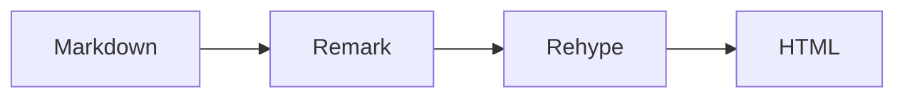
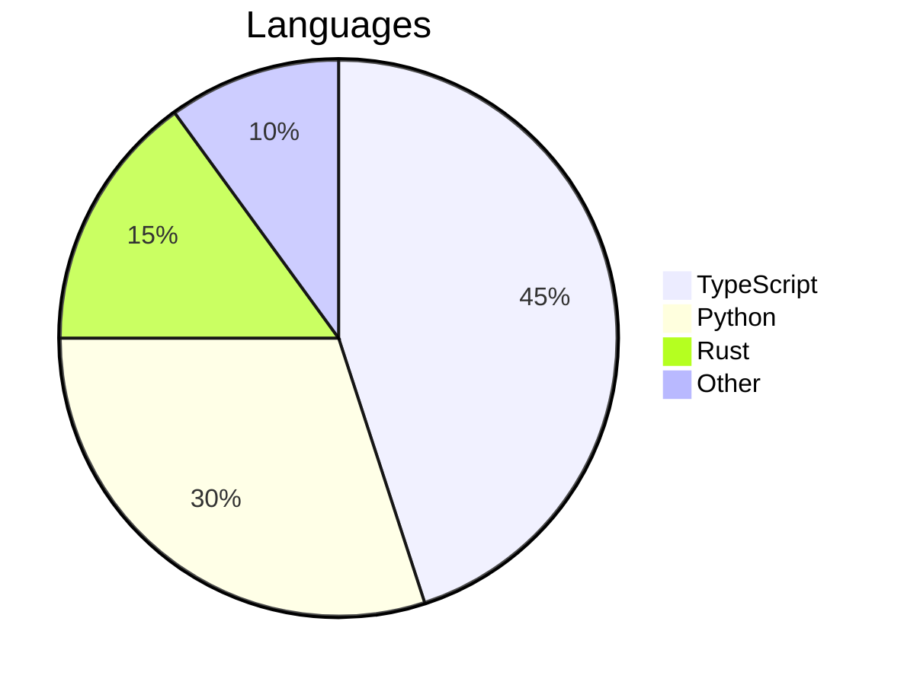

# Advanced Syntax

## HTML Blocks

Standard HTML tags are supported directly in markdown files. Common examples include `<kbd>` for keyboard shortcuts, `<sup>`/`<sub>` for superscripts and subscripts, and `<details>`/`<summary>` for accordions.

```md
Press <kbd>Ctrl</kbd> + <kbd>C</kbd> to copy. Water is H<sub>2</sub>O.
```

Renders as:

Press <kbd>Ctrl</kbd> + <kbd>C</kbd> to copy. Water is H<sub>2</sub>O.

Since Livemark uses MDX, HTML attributes follow JSX conventions: use `className` instead of `class`, and `style` takes an object instead of a string.

Tailwind CSS 4 utility classes are available in HTML blocks via `className`:

```md
<div className="rounded-lg border border-border bg-card p-4 text-sm text-muted-foreground">
  A styled container using Tailwind utilities.
</div>
```

Renders as:

<div className="rounded-lg border border-border bg-card p-4 text-sm text-muted-foreground">
  A styled container using Tailwind utilities.
</div>

## MDX Rendering

Livemark uses MDX under the hood, so JSX expressions and components can be used directly in markdown files when needed:

```md
export const version = "2.0.0"

The current version is **{version}**.
```

You can also import modules:

```md
import { authors } from "./data.ts"

{authors.map(a => <span key={a.name}>{a.name}</span>)}
```

This is an escape hatch for advanced use cases. Prefer standard markdown and directive syntax when possible.

## LaTeX Expressions

LaTeX math expressions are supported via KaTeX.

Inline math uses single dollar signs: `$E = mc^2$` renders as $E = mc^2$. Use it for variables like $x$, $\alpha$, or expressions like $\sum_{i=1}^{n} i$.

Display math uses double dollar signs for centered, block-level equations:

$$
\int_{-\infty}^{\infty} e^{-x^2} dx = \sqrt{\pi}
$$

$$
f(x) = \frac{1}{\sigma\sqrt{2\pi}} e^{-\frac{(x-\mu)^2}{2\sigma^2}}
$$

Matrices and aligned equations:

$$
\begin{bmatrix} a & b \\ c & d \end{bmatrix} \begin{bmatrix} x \\ y \end{bmatrix} = \begin{bmatrix} ax + by \\ cx + dy \end{bmatrix}
$$

## Mermaid Diagrams

Render diagrams using Mermaid syntax. Diagrams automatically adapt to light and dark themes.

````md

````

Renders as:


````md

````

Renders as:


## Included Documents

Reference content from other files using the `::include` directive. Markdown files are inlined with frontmatter stripped. Code files are automatically wrapped in a fenced code block with the language detected from the file extension.

Including a markdown file:

```md
::include{file="./includes/disclaimer.md"}
```

Renders as:

::include{file="./includes/disclaimer.md"}

Including a code file:

```md
::include{file="./includes/example.ts"}
```

Renders as:

::include{file="./includes/example.ts"}

Code file meta (title, line highlighting, etc.) can be passed via the `meta` attribute:

```md
::include{file="./includes/example.ts" meta="{2} lineNumbers"}
```

Renders as:

::include{file="./includes/example.ts" meta="{2} lineNumbers"}

Paths are resolved relative to the current file. Nested includes are supported up to 5 levels deep.
